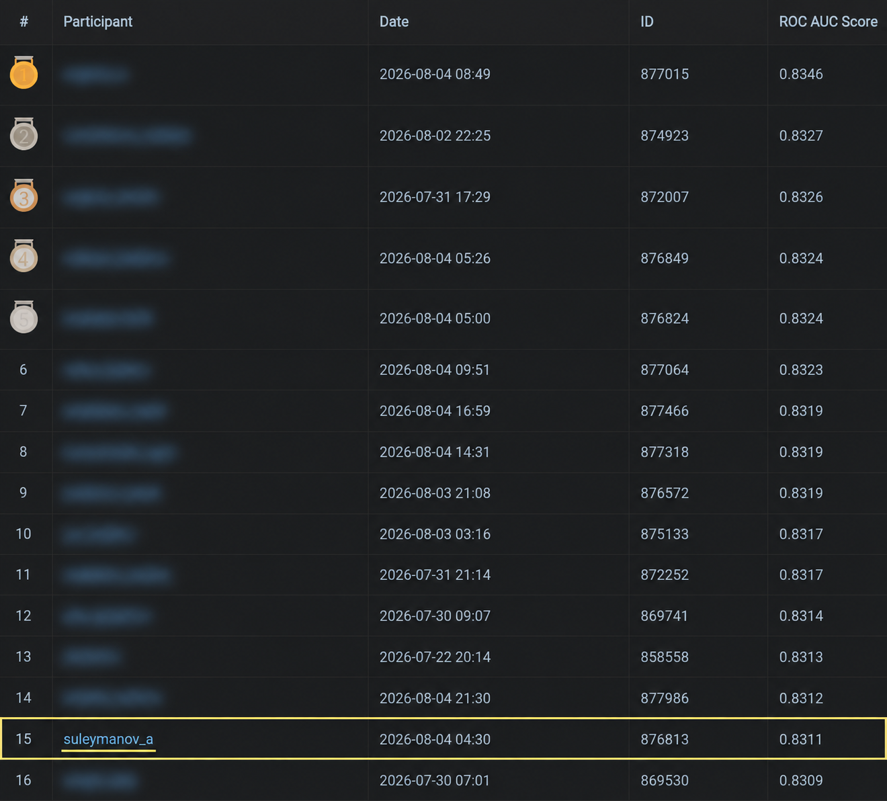

# Credit scoring

[Русская версия](README.md)

**15th place in a competition with 228 participants and 1331 submissions. ROC AUC 0.8311 on the organizers' undisclosed test set.**

The highest ROC AUC in the supplied leaderboard is 0.8346. My score is just 0.0035 lower, a gap of 0.35 percentage points. The relative gap is about 0.42 percent of the best score, less than one percent.

This solution earned me an invitation to the next selection stage, a video interview.

My solution for the Shift credit scoring competition. The task was to rank loan applications by the risk of serious delinquency within 90 days of issuing a loan.



My account is `suleymanov_a`, submission ID `876813`. Other participants' names are blurred and my row is highlighted. The screenshot shows the rank and score.

## Data and preparation

The organizers provided applications in `train.csv` and `test.csv`, plus three tables with transactions, credit bureau records and previous loans. After removing 8 duplicate training rows, there were 6480 labeled applications and 2520 test applications. About 34 percent of the training applications had the positive target.

I checked missing values, class balance, distributions and the coverage of the history tables. Three columns were completely empty in test, including two that describe events after the loan was issued. I removed them from the model. Using information that would only become available after making a prediction is data leakage: it can make validation look better than the model really is.

The history tables contain several records per client or application. I reduced them to one row using counts, sums, averages and maximums, then joined them to the applications. Useful examples include the largest past delay, credit utilization, transaction variability and the share of gambling transactions. I also added ratios such as estimated monthly payment divided by income. This payment estimate does not include interest.

## Models and validation

CatBoost uses 33 selected features. It builds decision trees one after another, with each new tree helping reduce the errors of the current model. It handles numerical missing values and categorical features without a separate one hot encoding step.

The second model is logistic regression with 17 features. Splines let numerical features have smooth curved effects instead of only straight line effects. I used median imputation, scaling and one hot encoding inside a scikit learn pipeline, so these steps are fitted only on the training part of each fold.

I used 8 stratified folds and repeated the split with three seeds. Stratification keeps the class balance similar across folds. Each out of fold prediction comes from a model that did not train on that row. Predictions for test are averaged across the fold models.

The final ensemble combines percentile ranks from both models. For example, a rank of 0.9 means an application is scored above roughly 90 percent of the sample. Combining ranks puts both models on a comparable scale. The blend weight is chosen from the middle of the near best range of validation scores.

ROC AUC measures how well the model ranks positive cases above negative ones. A random ranking scores around 0.5 and a perfect ranking scores 1. The submitted values are ranking scores, not calibrated probabilities of delinquency.

On local out of fold validation, CatBoost scored 0.83999, spline logistic regression scored 0.84221 and the ensemble scored 0.84345. The selected weights were 0.325 for CatBoost and 0.675 for the spline model. These are separate from the official test score of 0.8311.

Repeating folds checks sensitivity to the split, but it reuses the same labeled data. Feature and blend selection can make local validation optimistic. A future lending model would also need validation on later applications and probability calibration.

## Run the notebook

The solution was checked on Linux with Python 3.12.13. Download the five CSV files from the [organizers' data folder](https://drive.google.com/drive/folders/1P67wVcY0-u2jvhcMT82v1gb4hpxCXMu2?usp=sharing) and put them in a local `data` folder beside the notebook. The raw data is not included in Git.

```bash
python3.12 -m venv .venv
source .venv/bin/activate
python -m pip install -r requirements.txt
jupyter notebook competition.ipynb
```

Run the cells from top to bottom. The notebook covers EDA, feature preparation, validation, training and CSV export. The final settings are fixed, so running it does not start a new parameter search.

`submission.csv` is the unchanged file from the submitted archive. The verified run reproduced it byte for byte. A new run writes `outputs/submission.csv` and compares its IDs and scores with the original. Small numerical differences are possible with a different platform or library versions.

## Files

[competition.ipynb](competition.ipynb) contains the complete solution and saved results. [submission.csv](submission.csv) contains the 2520 submitted predictions. [requirements.txt](requirements.txt) lists the environment dependencies.
